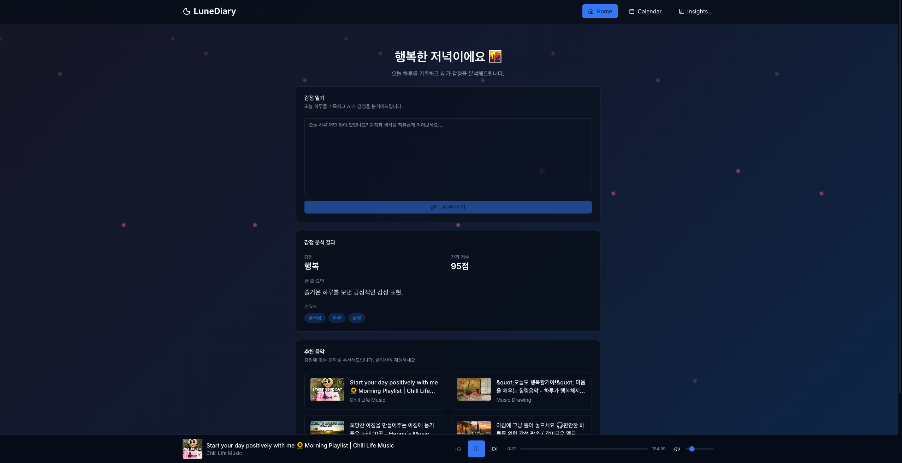
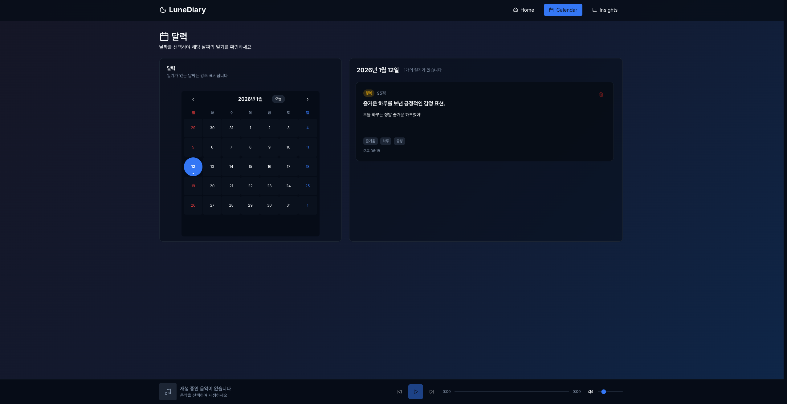
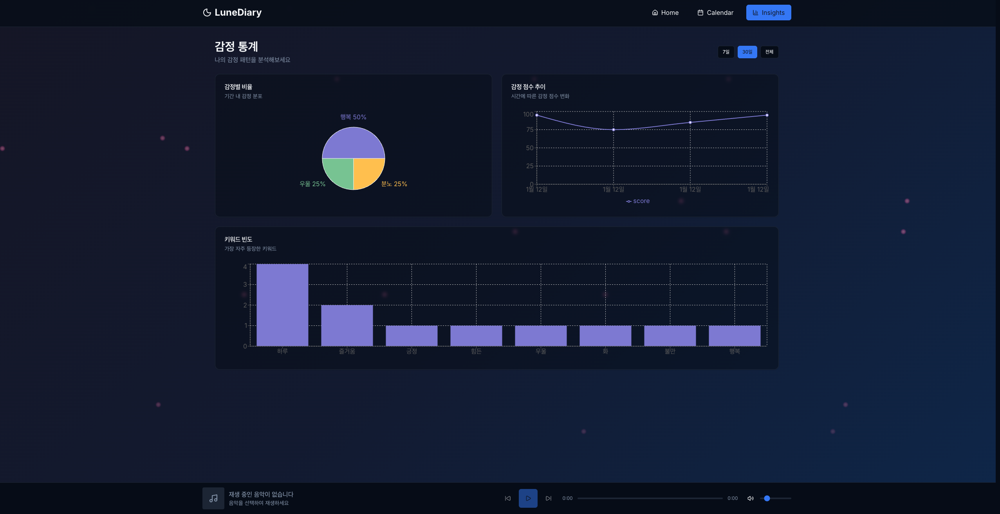

# LuneDiary 🌙

## 🔗 배포 링크

> https://lune-diary.netlify.app/

## 📋 프로젝트 소개

LuneDiary는 사용자가 하루의 감정을 텍스트로 기록하면 OpenAI GPT API가 감정을 분석하고 요약해주는 감정 일기 & AI 요약 대시보드 서비스입니다.  
감정에 따라 배경 애니메이션이 변경되고, YouTube API를 통해 감정에 맞는 음악을 추천합니다.

## 🛠️ 기술 스택

- **Frontend**: React 19, TypeScript
- **스타일링**: Tailwind CSS
- **상태 관리**: Zustand
- **애니메이션**: Framer Motion
- **차트**: Recharts
- **UI 컴포넌트**: Shadcn UI
- **라우팅**: React Router
- **API**: OpenAI GPT API, YouTube Data API v3
- **빌드 도구**: Vite
- **패키지 관리**: pnpm

## 📱 반응형 디자인

모든 페이지는 다음과 같은 브레이크포인트를 사용합니다:

- **모바일**: 기본 (640px 미만)
- **태블릿**: `sm:` (640px 이상)
- **데스크톱**: `md:` (768px 이상), `lg:` (1024px 이상)

## 🔑 환경 변수 설정

프로젝트를 실행하기 위해 다음 API 키가 필요합니다:

- **OpenAI API 키**: https://platform.openai.com/api-keys
- **YouTube Data API v3 키** (선택사항): https://console.cloud.google.com/apis/credentials

`.env` 파일을 프로젝트 루트에 생성하고 다음 변수를 설정하세요:

```
VITE_OPENAI_API_KEY=sk-your-openai-api-key-here
VITE_YOUTUBE_API_KEY=your-youtube-api-key-here
```

## 💾 데이터 저장

- Zustand의 `persist` 미들웨어를 이용하여 localStorage에 자동 저장
- 새로고침하여도 일기 데이터, 음악 설정, 프롬프트 템플릿이 유지됩니다

## ✨ 주요 기능

### 1. 🏠 Home 페이지

감정 일기를 작성하고 AI가 감정을 분석해주는 페이지입니다.

- 일기 텍스트 입력
- OpenAI GPT API를 통한 감정 분석
- 감정 이름, 점수(0~100), 한 줄 요약, 키워드 3개 제공
- 감정에 따라 배경 색상과 애니메이션 패턴 변경 (비, 별, 꽃잎, 불꽃, 안개 등)
- YouTube API를 통한 감정에 맞는 음악 추천
- 음악 플레이어 기능 (재생/정지, 볼륨 조절, 이전/다음 곡)



### 2. 📅 Calendar 페이지

일기를 달력 형태로 확인하고 상세 내용을 볼 수 있는 페이지입니다.

- 날짜별 일기 목록 확인
- 일기가 있는 날짜 시각적 강조 표시
- 일기 상세 내용 모달로 확인
- 감정 점수 및 키워드 시각화
- 일기 삭제 기능



### 3. 📊 Insights 페이지

작성한 일기 데이터를 통계로 시각화하여 확인할 수 있는 대시보드 페이지입니다.

- 날짜 범위 필터 (최근 7일, 30일, 전체)
- 감정별 비율 원형 차트 (Pie Chart)
- 감정 점수 추이 라인 차트 (Line Chart)
- 키워드 빈도 막대 차트 (Bar Chart)
- 데이터가 없을 때 빈 상태 UI

